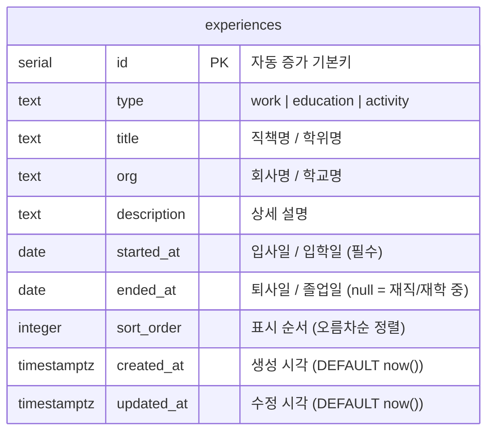

# Database Schema ERD

루나 포트폴리오 DB 스키마 정의입니다.

## ERD

## 컬럼 상세

| 컬럼 | 타입 | Null 허용 | 기본값 | 설명 |
|---|---|---|---|---|
| `id` | serial | ❌ | auto | 기본키 |
| `type` | text | ❌ | — | `work` / `education` / `activity` |
| `title` | text | ❌ | — | 직책명 또는 학위명 |
| `org` | text | ❌ | — | 회사명 또는 학교명 |
| `description` | text | ✅ | null | 상세 설명 |
| `started_at` | date | ❌ | — | 입사일 / 입학일 |
| `ended_at` | date | ✅ | null | 퇴사일 / 졸업일. null이면 현재 재직·재학 중 |
| `sort_order` | integer | ❌ | 0 | 타임라인 표시 순서 (낮을수록 먼저 표시) |
| `created_at` | timestamptz | ❌ | now() | 행 생성 시각 |
| `updated_at` | timestamptz | ❌ | now() | 행 수정 시각 |

## 비즈니스 규칙

- `ended_at`이 `null`이면 UI에서 **"현재"** 또는 **"재직 중"** 으로 표시
- `sort_order` 오름차순 → 최신 항목이 위에 오도록 낮은 값 부여 (예: 최신=10, 이전=20)
- `type` 값에 따라 UI 아이콘/색상 분기: `work`→Briefcase/mint, `education`→GraduationCap/sky, `activity`→Star/butter

## 마이그레이션 이력

| 날짜 | 내용 |
|---|---|
| 2026-06-04 | 최초 생성 — `experiences` 테이블 |
